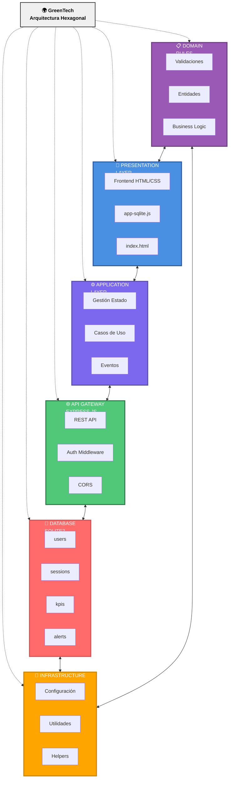
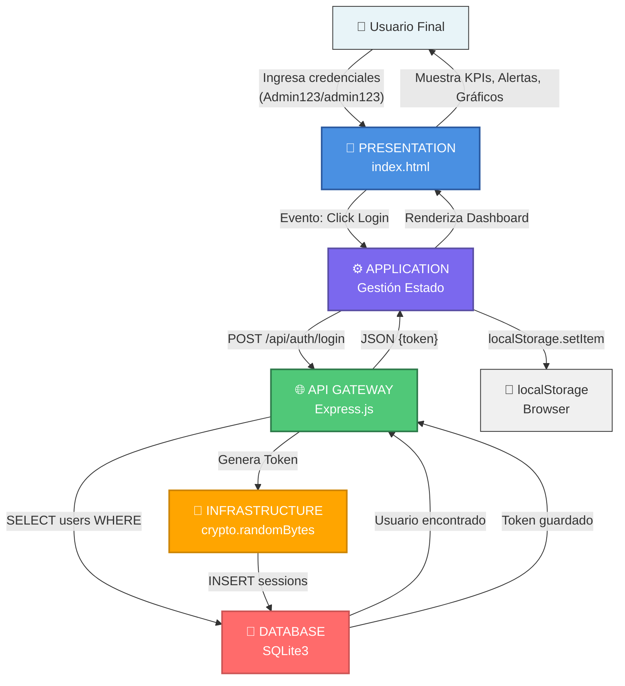
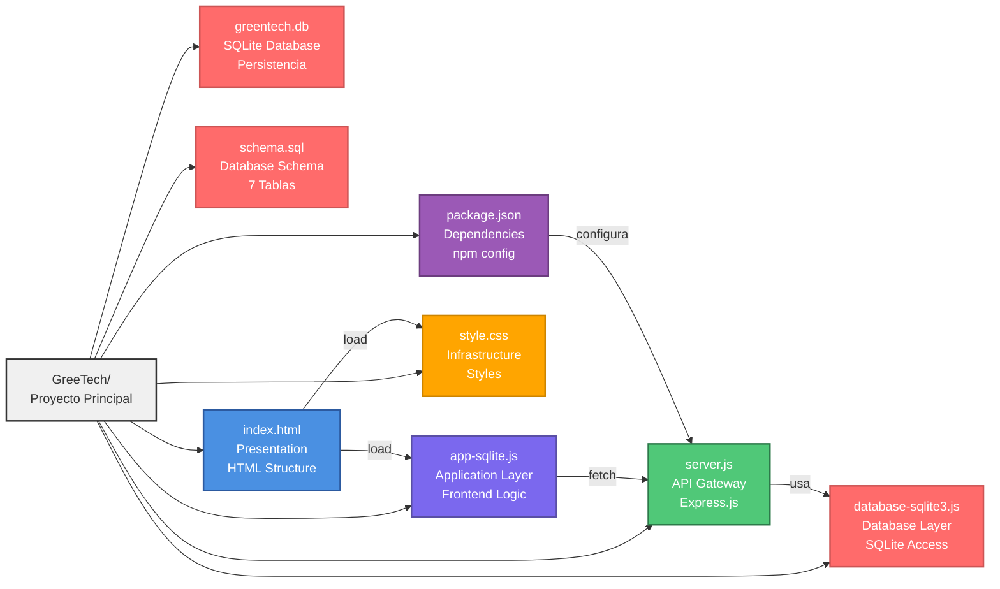
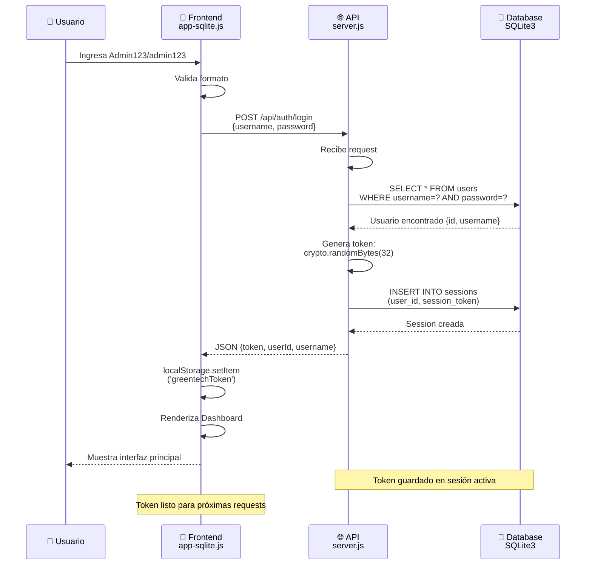
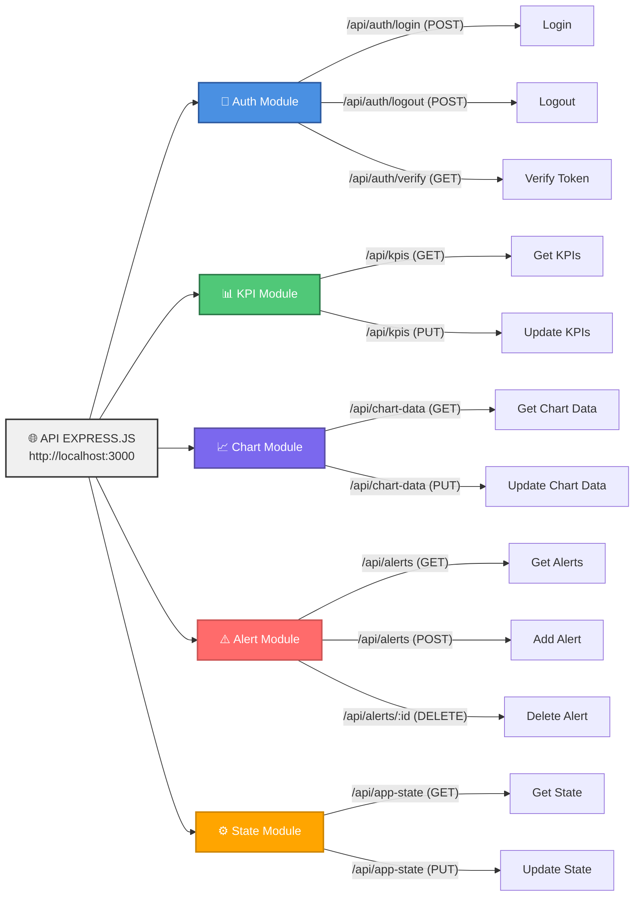
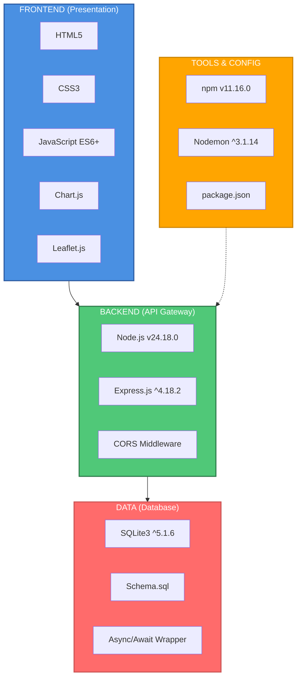

# 🔷 Diagramas Hexagonales - GreenTech Architecture

## Diagrama 1: Hexágono Interactivo (Mermaid)

---

## Diagrama 2: Flujo de Datos (Vertical)

---

## Diagrama 3: Arquitectura de Carpetas

---

## Diagrama 4: Flujo de Autenticación

---

## Diagrama 5: Componentes y Endpoints

---

## Diagrama 6: Stack Tecnológico por Capa

---

## Cómo Usar Estos Diagramas

1. **En GitHub**: Los diagramas Mermaid se renderizan automáticamente en README.md
2. **En Gemini**: Copia el código Mermaid y pide "mejora este diagrama" o "conviertelo a imagen"
3. **En Obsidian/Notion**: Usa bloques de código con lenguaje `mermaid`
4. **Exportar a PNG**: Usa [mermaid.live](https://mermaid.live) para exportar

---

## Exportar a Imagen

1. Abre https://mermaid.live
2. Copia y pega cualquier diagrama arriba
3. Click en "Download" → PNG/SVG
4. Guarda en tu carpeta del proyecto

---

**Todos estos diagramas representan la arquitectura hexagonal del GreenTech con diferentes perspectivas para mejor comprensión.**
