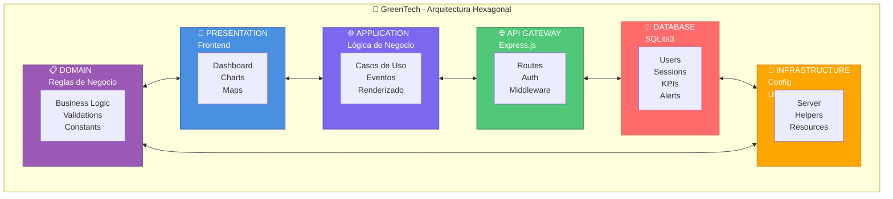

# 🔷 Prompt para Gemini - Generar Diagrama Hexagonal

## Copiar y Pegar en Gemini

```
Necesito que generes un diagrama hexagonal que represente la arquitectura del sistema GreenTech Amazon Systems.

El hexágono debe tener 6 capas distribuidas en los 6 vértices:

1. **PRESENTATION LAYER** (Arriba - Centro)
   - Frontend: HTML5, CSS3, JavaScript
   - Archivos: index.html, app-sqlite.js, style.css
   - Interfaces: Dashboard, Alertas, Mapas, Gráficos
   - Usuarios finales

2. **APPLICATION LAYER** (Arriba-Derecha)
   - Orquestación de casos de uso
   - Gestión de estado
   - Manejo de eventos
   - Lógica de negocio del cliente

3. **API GATEWAY** (Abajo-Derecha)
   - Express.js Server
   - Rutas REST: /api/auth, /api/kpis, /api/alerts, /api/chart-data
   - Middleware: autenticación, CORS, validación
   - Archivo: server.js

4. **DATABASE LAYER** (Abajo - Centro)
   - SQLite3
   - Tablas: users, sessions, kpis, alerts, chart_data, app_state, reports
   - Persistencia completa
   - Archivo: greentech.db, database-sqlite3.js

5. **INFRASTRUCTURE LAYER** (Abajo-Izquierda)
   - Configuración del servidor
   - Utilidades y helpers
   - Gestión de recursos
   - Adaptadores externos

6. **DOMAIN LAYER** (Arriba-Izquierda)
   - Reglas de negocio
   - Entidades del dominio
   - Lógica de validación
   - Estados y constantes

**Requisitos del diagrama:**
- Mostrar un hexágono regular con cada capa en un vértice
- En el centro del hexágono: "GreenTech Amazon Systems\nArquitectura Hexagonal"
- Flechas bidireccionales entre capas adyacentes mostrando la comunicación
- Colores diferentes para cada capa (puedes usar: azul, verde, rojo, amarillo, púrpura, naranja)
- Incluir iconos o símbolos representativos
- Estilo moderno y profesional
- Etiquetas claras con los nombres de componentes principales

Formato preferido: Mermaid, diagrama ASCII avanzado, o descripción detallada para luego convertir a imagen.
```

---

## Alternativa Simplificada para Gemini

```
Crea un diagrama hexagonal profesional con estos 6 componentes del sistema GreenTech:

1. Presentation (Frontend HTML/CSS/JS)
2. Application (Lógica de negocio)
3. API Gateway (Express.js REST)
4. Database (SQLite3)
5. Infrastructure (Config y utilidades)
6. Domain (Reglas de negocio)

En el centro: "GreenTech - Arquitectura Hexagonal"

Muestra cómo se comunican entre sí con flechas. Usa colores vibrantes y hazlo profesional.
```

---

## Copiar a Gemini para Mermaid



---

## Para Claude Sonnet o GPT-4

```
Genera un diagrama en SVG o HTML de un hexágono que represente:
- 6 vértices con los 6 componentes del sistema GreenTech
- Centro con el título "GreenTech Amazon Systems"
- Conexiones entre cada componente
- Colores vibrantes (azul, verde, rojo, amarillo, púrpura, naranja)
- Estilo profesional y moderno
- Componentes: Presentation, Application, API Gateway, Database, Infrastructure, Domain
```

---

## Instrucciones para Usar

1. **Copia uno de los prompts arriba**
2. **Abre Gemini** (gemini.google.com)
3. **Pega el prompt en el chat**
4. **Espera a que Gemini genere el diagrama**
5. **Si lo pide, solicita que lo exporte en formato Mermaid o imagen**
6. **Guarda el diagrama y cópialo en tu README**

---

## Resultado Esperado

El diagrama debe mostrar claramente:
- ✅ 6 capas hexagonales
- ✅ Comunicación bidireccional entre capas
- ✅ Nombres de componentes
- ✅ Tecnologías usadas en cada capa
- ✅ Centro identificando el sistema
- ✅ Colores diferenciados
- ✅ Diseño profesional

---

**Nota**: Si Gemini no entiende, prueba con "Draw a hexagonal architecture diagram" o "Create a hexagon with 6 layers".
