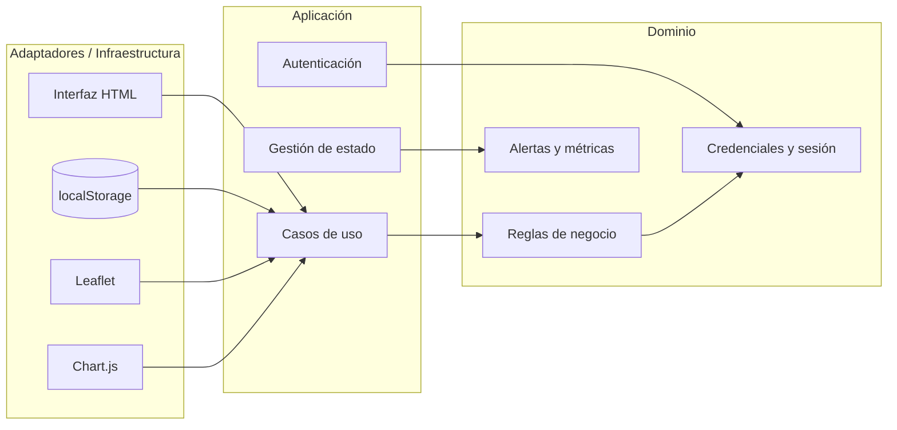

# GreenTech - Login y arquitectura hexagonal

## Descripción
Este proyecto incluye un flujo de autenticación simple para el sistema GreenTech. El login se encuentra en [index.html](index.html) y permite acceder al panel principal tras ingresar credenciales válidas.

## Funcionalidad del login
- Se muestra una pantalla de acceso inicial antes de entrar al sistema.
- El usuario debe ingresar un nombre de usuario y una contraseña.
- Si las credenciales coinciden, se permite avanzar al contenido principal.
- Si son incorrectas, aparece un mensaje de error.

## Credenciales actuales
Para probar el login en esta versión de demostración, use:
- Usuario: Admin123
- Contraseña: admin123

## Arquitectura hexagonal aplicada
La estructura del proyecto fue reorganizada para separar claramente las responsabilidades sin cambiar la funcionalidad del sistema.

### Capas principales
- Dominio: contiene las reglas de negocio, estados, autenticación y lógica de alertas en [app.js](app.js).
- Aplicación: orquesta los casos de uso como renderizado, navegación entre pestañas y gestión del estado.
- Infraestructura: interactúa con el DOM, localStorage, Chart.js y Leaflet.

### Diagrama del modelo hexagonal

## Archivos relacionados
- [index.html](index.html): contiene la interfaz de login y la estructura visual de la aplicación.
- [app.js](app.js): centraliza la lógica organizada por capas.
- [generate_pdfs.py](generate_pdfs.py): genera los reportes en formato PDF usados por la aplicación.

## Cómo probarlo
1. Abrir [index.html](index.html) en un navegador.
2. Ingresar las credenciales indicadas arriba.
3. Presionar el botón de acceso para entrar al sistema.

## Notas importantes
- Esta implementación es una demostración frontend y no usa autenticación real ni almacenamiento seguro de contraseñas.
- En un entorno de producción, se recomienda reemplazar esta lógica por un sistema de autenticación backend con validación segura.

## Sugerencias futuras
- Integrar autenticación con un servidor real.
- Agregar recuperación de contraseña.
- Implementar sesiones y cierre de sesión robusto.
